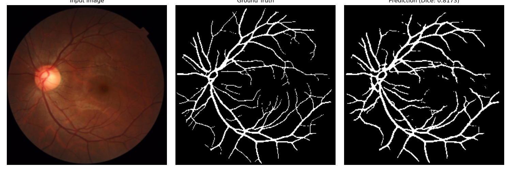
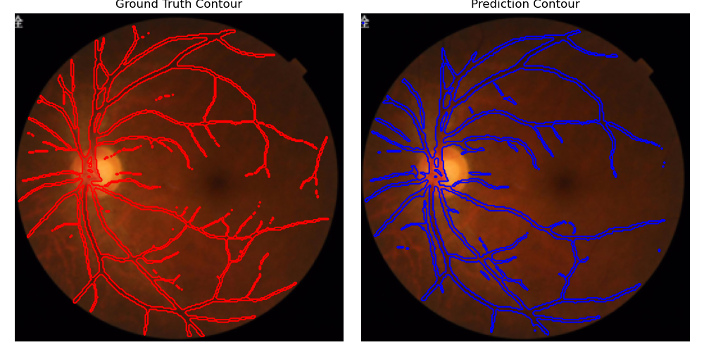

# Retina Vessel Segmentation using Deep Learning

Deep learning model for segmenting blood vessels in retinal images.

## 📌 Overview
This repository contains a deep learning model trained for retinal blood vessel segmentation from fundus images. The model demonstrates performance in identifying vascular structures, which can be useful for diabetic retinopathy screening and other ophthalmological applications.

## 📋 Results

### Figure 1: Ground Truth vs Prediction Comparison
  
*Left: Input retinal image • Middle: Ground truth annotation • Right: Model prediction with rejection threshold (0.01/3)*

### Figure 2: Contour Comparison
  
*Upper: Ground truth vessel contours • Lower: Predicted vessel contours*

## 🛠 Installation
```bash
git clone [repository-url]
cd [repository-name]
pip install -r requirements.txt
📧 Contact
For questions or collaborations, please contact:
Mahdi Esmaeili Shafaei
📩 mahdi.esmaeili.shafaei@gmail.com
